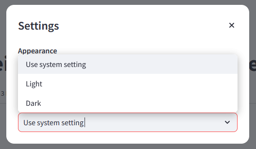

# FAQ

Cette section répond aux questions fréquemment posées sur l'outil de calcul AMOén.
Pour faciliter la lecture, les réponses sont cachées par défaut. Il suffit de
`Cliquer pour voir la solution` pour obtenir la réponse.

---

## Site zzz

Cliquer pour voir la solution

Le site montre ce message:

Veuillez appuyer sur le bouton pour redémarrer le site. Celui-ci se met état de
veille pour économiser de l'énergie s'il n'y a pas a eu d'activité depuis
quelques jours. Le site se remet en marche au bout de 2-3 minutes.

---

## Comment changer le mot de passe?

Cliquer pour voir la solution

Le menu à gauche de l'écran permet de changer de mot de passe. Il suffit de
cliquer sur le bouton *Change password*.

Une fenêtre s'ouvre pour renseigner l'ancien mot de passe et le nouveau mot de passe.

Les nouveaux mots de passe doivent respecter les critères suivants:

- Entre 8 et 20 caractères
- Au moins une lettre majuscule
- Un chiffre
- Un caractère spécial [@$!%*?&]

---

## Changer le mode sombre/clair

Cliquer pour voir la solution

Il est possible de changer le mode de l'outil de calcul en mode sombre. Pour cela,
il suffit de cliquer sur les trois petits points en haut à droite de l'écran.

Appuyez sur *Settings* et sélectionnez le mode souhaité.

---

## Comment ajouter un nouveau projet?

Pour l'instant il n'y a pas de manière automatisée pour ajouter un nouveau projet.
Il faut contacter un des administrateurs de l'outil pour ajouter un nouveau projet.
