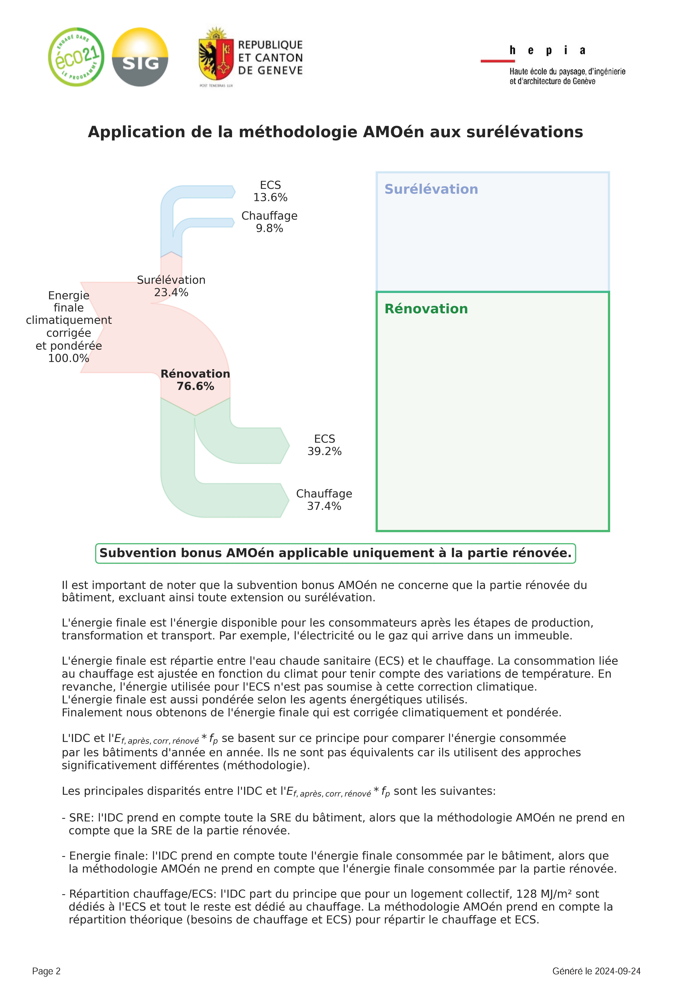

# Surélévations

Cette section décrit les spécificités des surélévations.

---

## Introduction

La méthodologie AMOén ne prends pas en en compte la partie
surélévée des bâtiments. Seule la partie rénovée est prise en compte.

Dans les cas sans surélévation, il n'y pas de distinction à faire car tout est considéré comme rénové.

Les principales différences avec un projet sans surélévation sont les suivantes:

|  | Surélévation | Sans surélévation |
| ------- | ---------- | ------------ |
| SRE rénovée | Seul la SRE de la partie rénovée est prise en compte. | Toute la SRE |
| Objectif Ef,obj,ren * fp | L'objectif a atteindre concerne que la partie rénovée. | L'objectif a atteindre concerne tout le bâtiment |
| Répartition énergie finale | La répartition de l'énergie finale entre le chauffage et l'ECS pour la partie surélévée doit être renseignée | La répartition de l'énergie finale entre le chauffage et l'ECS pour la partie surélévée est égale à 0 |

---

## Onglet *1 Données du site*

Le tableau ci-dessous décrit les particularités des surélévations pour l'onglet *1 Données du site*.

| Section | Menu concerné | Commentaire | Renseigné automatiquement |
| ------- | ------------- | ----------- | ------------------------- |
| Chargement données de base du projet | SRE rénovée (m²) | Seulment la SRE de la partie rénovée. La SRE de la surélévation est exclue. | oui |
| Chargement données de base du projet | Ef,obj * fp [kWh/m²/an] | Concerne seulement la partie rénovée | oui |
| Chargement données de base du projet | Chauffage partie surélévée/ECS partie surélévée [%] | Répartition énergie finale pour la surélévation | oui |
| Eléments à renseigner | Affectations | Affectations de tout le bâtiment | Souvent |
| Eléments à renseigner | Agents énergétiques | Agents énergétiques de tout le bâtiment | non |

---

## Note de calcul

Le rapport inclus une deuxième page avec des informations spécifiques aux surélévations.

Cliquer pour voir un example

